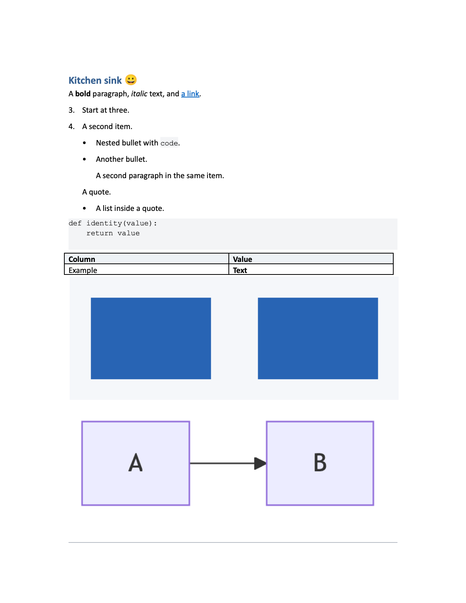
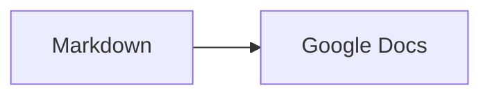

# Markdown to Google Docs

Convert Markdown to Google Docs through a shared Codex/Claude skill or standalone
CLI, with local Mermaid diagrams, editable code, native tables, and validation.

**Status:** DOCX conversion and native Google Docs import through the connected
Drive MCP passed kitchen-sink checks. Both pages of a fresh Google PDF export
were visually inspected; the first is shown below. This verifies the fixture,
not every document layout. Standalone OAuth upload remains unverified live.



Actual first page exported by Google Docs from the
[kitchen-sink Markdown](tests/fixtures/kitchen-sink.md), with no simulated UI.
The second page preserves unsupported HTML literally and reports a warning.

## Prerequisites

- Python 3.10+.
- A connected **Google Drive MCP** for the agent to create Google Docs. It must
  support document creation or DOCX import, plus reading the result.
- Node.js for Mermaid diagrams.

DOCX-only conversion works without an MCP connection.

## Quick start

From this repository:

```bash
python -m venv .venv
```

Activate with `.venv\Scripts\Activate.ps1` on PowerShell or
`source .venv/bin/activate` on macOS/Linux. Then run:

```bash
python -m pip install .
md2gdoc tests/fixtures/basic.md -o output/basic.docx
md2gdoc tests/fixtures/kitchen-sink.md --dry-run
```

For Mermaid diagrams, install Node.js and run `npm ci` first.
Each conversion saves a DOCX and a JSON report with any warnings.
HTML stays plain text. Math, footnotes, and task lists are not supported.

## Compatibility

“Native” means editable document content; “Rendered” means an embedded image.
The DOCX/import column describes the full conversion path. Direct native requests
support a smaller subset and reject other structures before creating a document.

| Markdown | DOCX → Google Docs import | Direct native requests |
| --- | --- | --- |
| Headings / paragraphs | Native styles and text | Native |
| Bold / italic / links | Native formatting | Native |
| Ordered / unordered / nested lists | Native lists, starts and nesting | Unsupported |
| Tables | Native tables and cell formatting | Unsupported |
| Inline / fenced code | Editable monospace text and shading | Editable monospace text and shading |
| Mermaid | Rendered PNG; source retained locally | Unsupported |
| Images | Embedded image; alt text retained | Unsupported |
| Blockquotes | Indented paragraphs | Unsupported |
| Horizontal rules | Paragraph border | Unsupported |
| HTML | Best effort: literal text and warning | Literal text and warning |
| Task lists / math / footnotes / strikethrough | Unsupported: literal fallback and syntax warnings | Same fallback |
| Excess table cells | Best effort: whole table kept literally, with warning | Literal fallback |

`--strict` fails on warnings and prevents upload on degradation. `--dry-run`
checks the source and local dependencies without writing files or contacting
Google. See [usage and limitations](docs/USAGE.md).

## Mermaid and code

````markdown
```python
def identity(value):
    return value
```


````

Code stays selectable. Mermaid uses the local official CLI, with no rendering
service or API key. Missing images and failed diagrams remain visible and fail
validation. Image downloads require `--allow-remote-images`.

## Google authentication

Local DOCX conversion needs no Google account. A connected Drive MCP handles its
own sign-in. For standalone upload, install `.[google]`, configure your own desktop
OAuth client, and use `--upload --credentials /path/to/client.json`.
See [setup, scopes, token storage, and revocation](docs/USAGE.md#google-authentication).

## Repeat publishing

```bash
md2gdoc notes.md --upload --folder-id FOLDER_ID
md2gdoc notes.md --upload --update
```

Uploads save document identity locally; updates check for remote edits and use
an atomic revision guard. This first update path supports single-tab text/code
documents. Complex documents still use new DOCX imports. Use `--new` to explicitly
create another Doc. See [update scope and conflict recovery](docs/USAGE.md#update-an-existing-document).

## Install as an agent skill

One canonical skill runs in both agents. Each needs the Python engine's two
dependencies; add Node.js only if you want Mermaid diagrams.
The packaged installation paths below target Codex and Claude Code;
ChatGPT-specific installation is not verified.

```bash
python -m pip install "markdown-it-py>=4.2,<5" "python-docx>=1.2,<2"
```

### Claude Code

Add this repository as a plugin marketplace, then install from it:

```text
/plugin marketplace add zhuy9/markdown-to-google-docs
/plugin install markdown-to-google-docs@markdown-to-google-docs
```

The same two commands work outside a session as `claude plugin marketplace add`
and `claude plugin install`. A local checkout can be used as the marketplace
source instead: pass its absolute path to `marketplace add`.

### Codex

Extract the skill archive into a skills directory Codex scans, either
`~/.agents/skills` for every project or `.agents/skills` inside one repository:

```bash
mkdir -p ~/.agents/skills
curl -L -o skill.zip https://github.com/zhuy9/markdown-to-google-docs/releases/latest/download/markdown-to-google-docs-skill.zip
unzip skill.zip -d ~/.agents/skills
```

The archive already contains a copy of the engine, so no checkout is needed.
Invoke it with `$markdown-to-google-docs`, or run `/skills` to browse.

### Using it

Ask the agent to convert a Markdown file. It writes a DOCX plus a JSON report,
then either uploads through a connected Google Drive tool or hands back the file
to import yourself. Upload the DOCX to Drive and open it with Google Docs;
optional direct upload uses your own Google sign-in. Keep credentials and tokens
outside this repository.

See [setup and usage](docs/USAGE.md) for Google upload details and for building
the archives yourself with `python tools/build_skill.py`.

## Contributing

See [contributing](CONTRIBUTING.md), [architecture](docs/ARCHITECTURE.md), and
[roadmap](docs/ROADMAP.md). Hosted CI passes on the current main commit, and
`v0.1.1` is published with all four release assets.

[MIT license](LICENSE).
