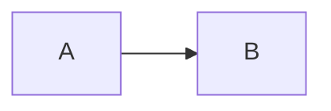

# Kitchen sink 😀

A **bold** paragraph, *italic* text, and [a link](https://example.com/).

3. Start at three.
4. A second item.
   - Nested bullet with `code`.
   - Another bullet.

     A second paragraph in the same item.

> A quote.
>
> - A list inside a quote.

```python
def identity(value):
    return value
```

| Column | Value |
| --- | --- |
| Example | **Text** |




---

<details>
<summary>Unsupported HTML</summary>
Keep this content visible and report a warning.
</details>
